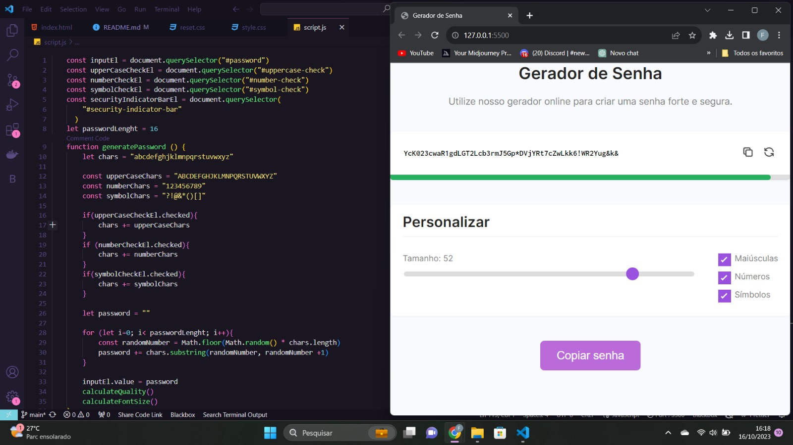
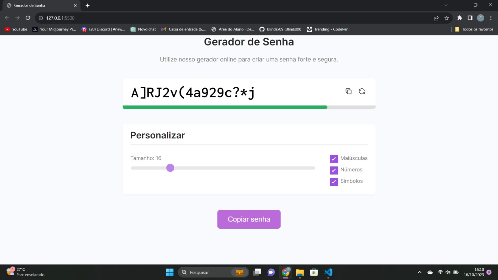

<h1 align="center"> Gerador de Senhas </h1>

Gerador de Senhas criado e desenvolvido em JavaScript, promovido em aulas pela <a href="https://st.devsamurai.com.br/0cqlvn/index.html?utm_source=&utm_medium=cpc&utm_campaign=15847297851&utm_content=574424152468&xpromo=gl-574424152468&utm_term=133556228353&gclid=CjwKCAjwgsqoBhBNEiwAwe5w00y09GzlK7NZOr0fi6jTAWuzYmnKX-u8DlMKIWQb5fOEQE8KVYk8HBoCt5UQAvD_BwE" target="_blank">Dev Samurai</a> para ensino de tecnologias WEB.  

  <a href="#-tecnologias">Tecnologias</a>&nbsp;&nbsp;&nbsp;|&nbsp;&nbsp;&nbsp;
  <a href="#-projeto">Projeto</a>&nbsp;&nbsp;&nbsp;|&nbsp;&nbsp;&nbsp;
  <a href="#-layout">Layout</a>&nbsp;&nbsp;&nbsp;|&nbsp;&nbsp;&nbsp;
  <a href="#memo-licença">Licença</a>

  

 

## 🚀 Tecnologias

Esse projeto foi desenvolvido com as seguintes tecnologias:

- HTML e CSS 
- JavaScript
- Git e Github

## 💻 Projeto

Um Gerador de Senhas desenvolvido em aulas para aplicar alguns fundamentos de programação, utilizando JavaScript.  

- [Acesse o projeto finalizado, online](https://blindsx09.github.io/password-generator/)

## 🔖 Layout

## Licença

Esse projeto está sob a licença MIT.

---